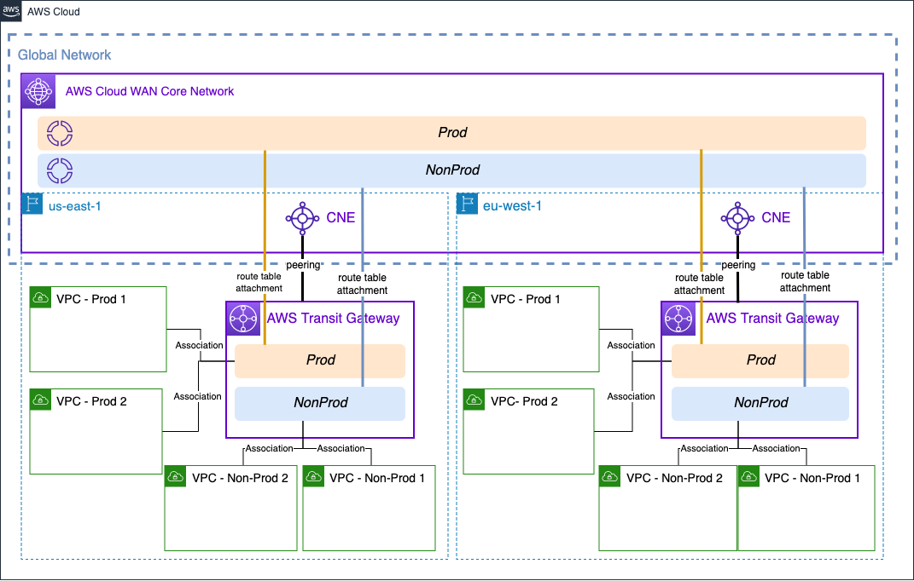

## Achieving traffic segmentation in multi-AWS Region environments using AWS Transit Gateway and AWS Cloud WAN

This repository shows a Terraform example on how to extend Transit Gateway route tables to AWS Cloud WAN segments, with the end goal of achieving traffic segmentation between routing domains in different AWS Regions when using AWS Transit Gateway. 

This example builds the following resources (same in both AWS Regions indicated above):

* AWS Transit Gateway, with 2 Route Tables (*prod* and *nonprod*)
* 4 Spoke VPCs - 2 for *prod* and 2 for *nonprod* routing domain. The definition of the VPCs can be found in the *variables.tf* file.
* Cloud WAN resources - Global Network and Core Network. The policy can be found in the *cwan.tf* file.
* Transit Gateway policy table - and association to the peering connection.
* Cloud WAN - Transit Gateway peering connection.
* Transit Gateway route table attachment - *prod* and *nonprod*.

## Prerequisites
* An AWS account with an IAM user with the appropriate permissions
* Terraform installed

## Code Principles:
* Writing DRY (Do No Repeat Yourself) code using a modular design pattern

## Deployment and cleanup
* Clone the repository.
* Check the *variables.tf* file.
* Use `terraform apply` to create all the resources listed above.
* Remember to clean up after your work is complete. You can do that by doing `terraform destroy`. Note that this command will delete all the resources previously created by Terraform.

## Security

See [CONTRIBUTING](CONTRIBUTING.md#security-issue-notifications) for more information.

## License

This library is licensed under the MIT-0 License. See the LICENSE file.